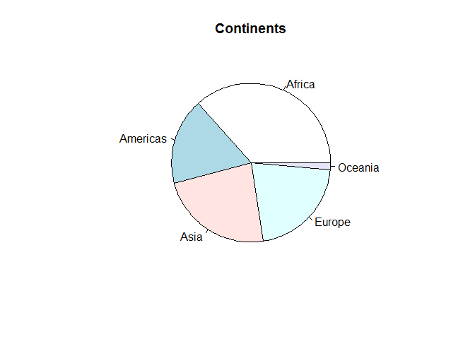
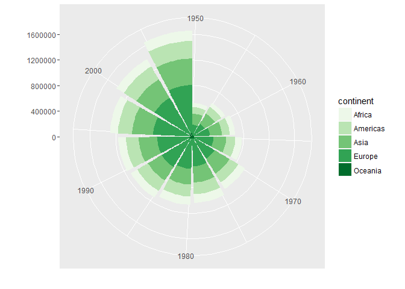
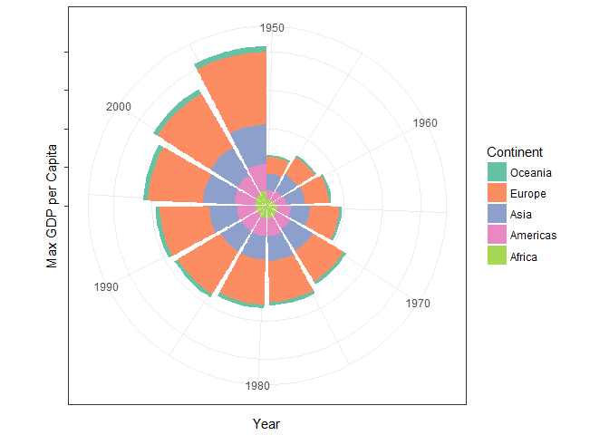
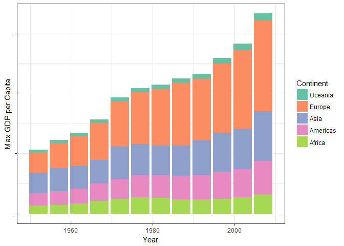

# hw5
Wade  
October 14, 2017  


```r
suppressWarnings(library(tidyverse))
suppressWarnings(library(gapminder))
suppressWarnings(library(forcats))
suppressWarnings(library(readxl))
```

For this assignment, I have been given orders to make several changes to the gapminder dataset, beginning with this one:

"<b>Drop Oceania.</b> Filter the Gapminder data to remove observations associated with the continent of Oceania. Additionally, remove unused factor levels. Provide concrete information on the data before and after removing these rows and Oceania; address the number of rows and the levels of the affected factors."


```r
filter(gapminder, continent=="Oceania")
```

```
## # A tibble: 24 × 6
##      country continent  year lifeExp      pop gdpPercap
##       <fctr>    <fctr> <int>   <dbl>    <int>     <dbl>
## 1  Australia   Oceania  1952   69.12  8691212  10039.60
## 2  Australia   Oceania  1957   70.33  9712569  10949.65
## 3  Australia   Oceania  1962   70.93 10794968  12217.23
## 4  Australia   Oceania  1967   71.10 11872264  14526.12
## 5  Australia   Oceania  1972   71.93 13177000  16788.63
## 6  Australia   Oceania  1977   73.49 14074100  18334.20
## 7  Australia   Oceania  1982   74.74 15184200  19477.01
## 8  Australia   Oceania  1987   76.32 16257249  21888.89
## 9  Australia   Oceania  1992   77.56 17481977  23424.77
## 10 Australia   Oceania  1997   78.83 18565243  26997.94
## # ... with 14 more rows
```

```r
#View(gapminder$continent)
length(gapminder$continent)
```

```
## [1] 1704
```

Before I make changes to the dataset, note that we have 1704 observations.


```r
gap<-gapminder %>% filter(continent!="Oceania")
filter(gap, continent=="Oceania")
```

```
## # A tibble: 0 × 6
## # ... with 6 variables: country <fctr>, continent <fctr>, year <int>,
## #   lifeExp <dbl>, pop <int>, gdpPercap <dbl>
```

```r
length(gap$continent)
```

```
## [1] 1680
```

Here we see that the rows associated with Oceania have been removed and the dataset contains 1680 observations, down from 1704.


```r
names(gapminder)
```

```
## [1] "country"   "continent" "year"      "lifeExp"   "pop"       "gdpPercap"
```

```r
sapply(data, levels)
```

```
## $...
## NULL
## 
## $list
## NULL
## 
## $package
## NULL
## 
## $lib.loc
## NULL
## 
## $verbose
## NULL
## 
## $envir
## NULL
## 
## [[7]]
## NULL
```

```r
str(gap)
```

```
## Classes 'tbl_df', 'tbl' and 'data.frame':	1680 obs. of  6 variables:
##  $ country  : Factor w/ 142 levels "Afghanistan",..: 1 1 1 1 1 1 1 1 1 1 ...
##  $ continent: Factor w/ 5 levels "Africa","Americas",..: 3 3 3 3 3 3 3 3 3 3 ...
##  $ year     : int  1952 1957 1962 1967 1972 1977 1982 1987 1992 1997 ...
##  $ lifeExp  : num  28.8 30.3 32 34 36.1 ...
##  $ pop      : int  8425333 9240934 10267083 11537966 13079460 14880372 12881816 13867957 16317921 22227415 ...
##  $ gdpPercap: num  779 821 853 836 740 ...
```

<h4>Reordering Factors and Making Improved Graphs</h4>

"Reorder the levels of country or continent. Use the forcats package to change the order of the factor levels, based on a principled summary of one of the quantitative variables. Consider experimenting with a summary statistic beyond the most basic choice of the median."

"Remake at least one figure or create a new one, in light of something you learned in the recent class meetings about visualization design and color."

This one will be fun. I have certainly learned a lot of new techniques in this class for displaying data in an aesthetically pleasing way. Let's try remaking my first plot using what I have learned.

The first plot I made back in hw2 was this one:


```r
pie(summary(gapminder$continent), main="Continents")
```

<!-- -->

It looks a bit plain, and it suffers from, well, being a pie chart. Pie charts are poor for a number of reasons. For one, as Tamara Munzner mentioned in her guest lecture, pie charts show proportions using areas and angles. The human perceptual system is not designed to handle very well. But I also saw a way to redeem pie charts...

I will also experiment with <b>reordering data</b> at the same time.


```r
g<-  gapminder %>% 
  group_by(continent, country, year)%>%
  summarize(max_GDP=max(gdpPercap))
#View(g)
```


```r
ggplot(data=g,aes(x=year,y=max_GDP,fill=continent))+
        geom_bar(stat="identity")+
        coord_polar()+
        scale_fill_brewer(palette="Greens")+xlab("")+ylab("")
```

<!-- -->

It looks cool, but I don't think we have the right color scheme. This color scheme shows a progression by continent which doesn't make sense. Also, the y-axis values do not look good and, worse, may even be misleading. Since we are interested mostly in showing an overall trend with this type of plot, I think it's best to remove the values on the y-axis altogether.

I also don't like that Oceania is at the center of the graph, because it contains data for only two countries. Luckily, there is a function in the forcats package that is designed specifically to address this problem.


```r
g2<- gapminder %>% 
  group_by(continent, country, year)%>%
  summarize(max_GDP=max(gdpPercap)) %>%
  mutate(Continent = fct_infreq(continent))%>%
  group_by(Continent, country, year)
str(g2$Continent)
```

```
##  Factor w/ 5 levels "Africa","Americas",..: 1 1 1 1 1 1 1 1 1 1 ...
```

```r
test <- fct_rev(g$continent)
str(test)
```

```
##  Factor w/ 5 levels "Oceania","Europe",..: 5 5 5 5 5 5 5 5 5 5 ...
```

```r
g2$continent<-fct_rev(g2$continent)
str(g2$continent)
```

```
##  Factor w/ 5 levels "Oceania","Europe",..: 5 5 5 5 5 5 5 5 5 5 ...
```


```r
knitr::kable(tail(g2, n=25),  format = "markdown")
```


|continent |country        | year|  max_GDP|Continent |
|:---------|:--------------|----:|--------:|:---------|
|Europe    |United Kingdom | 2007| 33203.26|Europe    |
|Oceania   |Australia      | 1952| 10039.60|Oceania   |
|Oceania   |Australia      | 1957| 10949.65|Oceania   |
|Oceania   |Australia      | 1962| 12217.23|Oceania   |
|Oceania   |Australia      | 1967| 14526.12|Oceania   |
|Oceania   |Australia      | 1972| 16788.63|Oceania   |
|Oceania   |Australia      | 1977| 18334.20|Oceania   |
|Oceania   |Australia      | 1982| 19477.01|Oceania   |
|Oceania   |Australia      | 1987| 21888.89|Oceania   |
|Oceania   |Australia      | 1992| 23424.77|Oceania   |
|Oceania   |Australia      | 1997| 26997.94|Oceania   |
|Oceania   |Australia      | 2002| 30687.75|Oceania   |
|Oceania   |Australia      | 2007| 34435.37|Oceania   |
|Oceania   |New Zealand    | 1952| 10556.58|Oceania   |
|Oceania   |New Zealand    | 1957| 12247.40|Oceania   |
|Oceania   |New Zealand    | 1962| 13175.68|Oceania   |
|Oceania   |New Zealand    | 1967| 14463.92|Oceania   |
|Oceania   |New Zealand    | 1972| 16046.04|Oceania   |
|Oceania   |New Zealand    | 1977| 16233.72|Oceania   |
|Oceania   |New Zealand    | 1982| 17632.41|Oceania   |
|Oceania   |New Zealand    | 1987| 19007.19|Oceania   |
|Oceania   |New Zealand    | 1992| 18363.32|Oceania   |
|Oceania   |New Zealand    | 1997| 21050.41|Oceania   |
|Oceania   |New Zealand    | 2002| 23189.80|Oceania   |
|Oceania   |New Zealand    | 2007| 25185.01|Oceania   |

From this table we can see that Oceania has been moved to the bottom of the list.


```r
ggplot(data=g2,aes(x=year,y=max_GDP, fill=continent))+
        geom_bar(stat="identity") +
        coord_polar() +
        scale_fill_brewer(palette="Set2")+xlab("Year")+ylab("Max GDP per Capita") +
        theme_bw() +
        theme(axis.text.y = element_blank()) +
        labs(fill="Continent")
```

<!-- -->

This looks pretty good. Admittedly, it doesn't fully redeem the pie chart, but this type of pie chart (called a rose plot) is certainly much better than a standard pie chart.

An even better way of displaying this data might be a stacked bar plot.


```r
ggplot(data=g2,aes(x=year,y=max_GDP,fill=continent))+
        geom_bar(stat="identity")+
        scale_fill_brewer(palette="Set2")+xlab("Year")+ylab("Max GDP per Capita") +
        theme_bw() +
        theme(axis.text.y = element_blank()) +
        labs(fill="Continent")
```

<!-- -->

Even this chart doesn't perfectly display this data. It may be an ill-posed problem, with no true solution. But I will argue that these charts display the data <i>well enough</i> for how complex the relationships are and are miles above the plain bar chart I produced at the beginning of this term!

<h4>Saving a Plot</h4>


```r
ggsave("barchart.pdf", height = 10)
```

```
## Saving 7 x 10 in image
```

```r
ggsave("barchart.jpg", height = 4, width = 4)
```


```r
getwd()
```

```
## [1] "C:/Users/Wade/OneDrive/2017 Fall Semester/Exploratory Statistics/stat545-hw5-wade-wade"
```


<h4>Experimenting with File I/O</h4>

I'm going to experiment with writing and reading CSV files, since that is the file type that I use most often in conjunction with R.


```r
write_csv(gapminder, "gapminder.csv")
```

Now I have the file saved in my project folder, so that's pretty cool.


```r
head(read_csv("C:/Users/Wade/OneDrive/2017 Fall Semester/Exploratory Statistics/stat545-hw5-wade-wade/gapminder.csv"))
```

```
## Parsed with column specification:
## cols(
##   country = col_character(),
##   continent = col_character(),
##   year = col_integer(),
##   lifeExp = col_double(),
##   pop = col_integer(),
##   gdpPercap = col_double()
## )
```

```
## # A tibble: 6 × 6
##       country continent  year lifeExp      pop gdpPercap
##         <chr>     <chr> <int>   <dbl>    <int>     <dbl>
## 1 Afghanistan      Asia  1952  28.801  8425333  779.4453
## 2 Afghanistan      Asia  1957  30.332  9240934  820.8530
## 3 Afghanistan      Asia  1962  31.997 10267083  853.1007
## 4 Afghanistan      Asia  1967  34.020 11537966  836.1971
## 5 Afghanistan      Asia  1972  36.088 13079460  739.9811
## 6 Afghanistan      Asia  1977  38.438 14880372  786.1134
```

This method doesn't appear too different from how I usually read csv's, but I noticed you don't need to type "header=TRUE." It doesn't even recognize that statement.

As a general tip, I find that whenever I read in data using the file address, my file address always has backward slashes instead of forward slashes. Use the ctrl+f find and replace to turn them into forward slashes so R can read the file.

<h4>Process</h4>
<li>I felt like this homework prompt was difficult to understand at times.</li>
<li>For instance, I Googled some information to see what the prompt was talking about for feeding a saved file into the markdown document. The first thing that came up was the stat545 website. I eventually figured it out, but I experienced some frustration with this step.</li>
<li>I found that there are a lot more errors involved when you try to save and read things outside of the R document you are working with. Sure, these can be overcome, but I think it may be best to avoid reading in too many outside files.</li>


